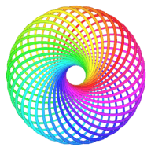
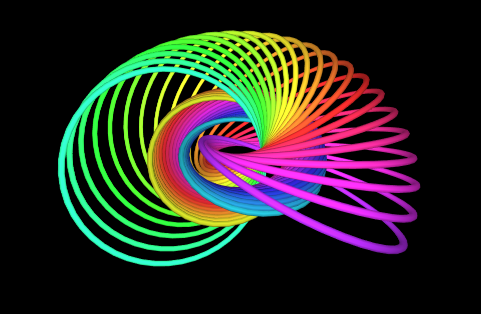

# Hopf Fibration Visualization 
A responsive interactive [visualization](https://wgxli.github.io/hopf-fibration) of the Hopf fibration.

## Usage
* Click on the sphere to add points.
* The main view shows the fibers over the given points under the Hopf map, stereographically projected into three-space.
* Drag to orbit and scroll to zoom. Touch gestures should work on mobile.
